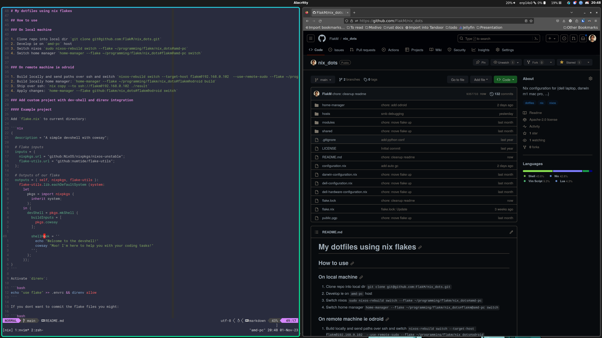

# My dotfiles using nix flakes



Higlights:

- hyprland for eye candy
- direnv integration for per project goodness
- custom neovim configuration for rust/nix development
- multiple hosts from same flake (x86 and arm m1 mac)
- zfs on root


## How to use

### On local machine

1. Clone repo into local dir `git clone git@github.com:FlakM/nix_dots.git` 
2. Develop ie on `amd-pc` host
3. Switch nixos `sudo nixos-rebuild switch --flake ~/programming/flakm/nix_dots#amd-pc`
4. Switch home manager `home-manager --flake ~/programming/flakm/nix_dots#flakm@amd-pc switch`


### On remote machine ie odroid

1. Build locally and send paths over ssh and switch `nixos-rebuild switch --target-host flakm@192.168.0.102  --use-remote-sudo --flake ~/programming/flakm/nix_dots#odroid`
2. Build locally home manager: `home-manager --flake ~/programming/flakm/nix_dots#flakm@odroid build`
3. Ship over ssh: `nix copy --to ssh://flakm@192.168.0.102 ./result`
4. Apply changes: `home-manager --flake github:flakm/nix_dots#flakm@odroid switch`

### On mac m1

1. Clone repo into local dir `git clone git@github.com:FlakM/nix_dots.git` 
2. Switch nixos 

### Add custom project with dev-shell and direnv integration


#### Example project

Add `flake.nix` to current directory:

```nix
{
  description = "A simple devshell with cowsay";

  # Flake inputs
  inputs = {
    nixpkgs.url = "github:NixOS/nixpkgs/nixos-unstable";
    flake-utils.url = "github:numtide/flake-utils";
  };

  # Outputs of our flake
  outputs = { self, nixpkgs, flake-utils }:
    flake-utils.lib.eachDefaultSystem (system:
      let
        pkgs = import nixpkgs {
          inherit system;
        };
      in {
        devShell = pkgs.mkShell {
          buildInputs = [
            pkgs.cowsay
          ];

          shellHook = ''
            echo "Welcome to the devshell!"
            cowsay "Moo! I'm here to help you with your coding tasks!"
          '';
        };
      });
}
```

Activate `direnv`:

```bash
echo "use flake" >> .envrc && direnv allow
```

If you dont want to commit the flake files you might:

```bash
git add --intent-to-add flake.* -f
git update-index --assume-unchanged flake.*
```

#### Example rust project

Just crane it!

```bash
# Start with a comprehensive suite of tests
nix flake init -t github:ipetkov/crane#quick-start
```


## Additional things to install (todo check if still required)

1. import gpg key

```bash
cat > ~/.ssh/id_rsa_yubikey.pub <<EOF
ssh-rsa AAAAB3NzaC1yc2EAAAADAQABAAACAQDh6bzSNqVZ1Ba0Uyp/EqThvDdbaAjsJ4GvYN40f/p9Wl4LcW/MQP8EYLvBTqTluAwRXqFa6fVpa0Y9Hq4kyNG62HiMoQRjujt6d3b+GU/pq7NN8+Oed9rCF6TxhtLdcvJWHTbcq9qIGs2s3eYDlMy+9koTEJ7Jnux0eGxObUaGteQUS1cOZ5k9PQg+WX5ncWa3QvqJNxx446+OzVoHgzZytvXeJMg91gKN9wAhKgfibJ4SpQYDHYcTrOILm7DLVghrcU2aFqLKVTrHSWSugfLkqeorRadHckRDr2VUzm5eXjcs4ESjrG6viKMKmlF1wxHoBrtfKzJ1nR8TGWWeH9NwXJtQ+qRzAhnQaHZyCZ6q4HvPlxxXOmgE+JuU6BCt6YPXAmNEMdMhkqYis4xSzxwWHvko79NnKY72pOIS2GgS6Xon0OxLOJ0mb66yhhZB4hUBb02CpvCMlKSLtvnS+2IcSGeSQBnwBw/wgp1uhr9ieUO/wY5K78w2kYFhR6Iet55gutbikSqDgxzTmuX3Mkjq0L/MVUIRAdmOysrR2Lxlk692IrNYTtUflQLsSfzrp6VQIKPxjfrdFhHIfbPoUdfMf+H06tfwkGONgcej56/fDjFbaHouZ357wcuwDsuMGNRCdyW7QyBXF/Wi28nPq/KSeOdCy+q9KDuOYsX9n/5Rsw== cardno:000614320136
EOF
chmod 600 ~/.ssh/id_rsa_yubikey.pub

cat << EOF >> ~/.ssh/config
Host github.com
    IdentitiesOnly yes
    IdentityFile ~/.ssh/id_rsa_yubikey.pub
EOF

gpg --card-status


ssh git@github.com -vvv


gpg --recv 0x6B872E24F09A547E
export KEYID=0x6B872E24F09A547E
# trust completly
gpg --edit-key $KEYID


gpg --output public.pgp --armor --export maciej.jan.flak@gmail.com

```

#### Manage secrets

Insert yubikey and run:

```bash
nix-shell -p sops --run "sops secrets/secrets.yaml"
```
